# ft_linear_regression: Predicting Prices with Linear Models 📈

[](https://www.42.fr/)
[](https://github.com/Nazar963/42_ft_linear_regression/blob/master/LICENSE)
[](https://python.org)
[](https://github.com/Nazar963/42_ft_linear_regression)

A minimal implementation of linear regression from scratch using gradient descent, predicting car prices based on mileage without machine learning libraries.

## Table of Contents 📖
- [Project Overview](#project-overview)
- [Mathematical Foundation](#mathematical-foundation)
- [Implementation](#implementation)
- [Features](#features)
- [Installation](#installation)
- [Usage](#usage)
- [Limitations](#limitations)
- [Resources](#resources)
- [License](#license)

## Project Overview

ft_linear_regression is a 42 School project that introduces fundamental machine learning concepts by implementing:
- Linear regression algorithm from scratch
- Gradient descent optimization
- Data normalization and denormalization
- Model training and prediction
- Visualization of results

**Project Requirements**:
- Implement without machine learning libraries (scikit-learn, TensorFlow, etc.)
- Use gradient descent for optimization
- Handle dataset normalization
- Calculate and display training metrics
- Save trained model parameters
- Predict prices based on mileage input

**Note**: Bonus features (multiple variables, advanced visualization) were not implemented in this solution.

## Mathematical Foundation

### Linear Regression Model
The algorithm models the relationship between mileage (x) and price (y) using:

$y = \theta_0 + \theta_1x$

Where:
- $\theta_0$: y-intercept (bias)
- $\theta_1$: slope (weight)

### Gradient Descent
Parameters are optimized by minimizing the Mean Squared Error (MSE) cost function:

$J(\theta_0, \theta_1) = \frac{1}{2m}\sum_{i=1}^{m}(h_\theta(x^{(i)}) - y^{(i)})^2$

Parameters are updated iteratively:

$\theta_0 := \theta_0 - \alpha \frac{\partial J}{\partial \theta_0}$  
$\theta_1 := \theta_1 - \alpha \frac{\partial J}{\partial \theta_1}$

Where $\alpha$ is the learning rate.

## Implementation

### Algorithm Flow

```mermaid
graph TD
    A[Load Dataset] --> B[Normalize Data]
    B --> C[Initialize θ₀, θ₁]
    C --> D[Calculate Predictions]
    D --> E[Compute Cost Function]
    E --> F[Update Parameters]
    F --> G{Converged?}
    G -- No --> D
    G -- Yes --> H[Denormalize Parameters]
    H --> I[Save Model]
    I --> J[Make Predictions]
```


### Key Points
```python
# Retrieve and normalize data
    file = pd.read_csv("data.csv")
    X = file["km"].values
    y = file["price"].values
    X = (X - np.mean(X)) / np.std(X)
    y = (y - np.mean(y)) / np.std(y)
    theta0 = 0          # Intercept
    theta1 = 0          # Slope
    learn_rate = 0.001
    iter = 1000
    m = len(y)

# Gradient descent and cost computation
def compute_cost(predictions, y, m):
    return (1 / (2 * m)) * np.sum((predictions - y) ** 2)

for i in range(iter):
    pred = theta0 + theta1 * X
    theta0 -= (learn_rate / m) * np.sum(pred - y)
    theta1 -= (learn_rate / m) * np.sum((pred - y) * X)
    if i % 100 == 0:
        cost = compute_cost(pred, y, m)
        print(f"Iteration {i}: Cost = {cost}")
```

## Features

### Core Functionality
- **Data Loading**: Reads CSV datasets with mileage and price
- **Feature Scaling**: Min-max normalization (0 to 1 range)
- **Gradient Descent**: Batch gradient descent implementation
- **Model Saving**: Stores θ₀ and θ₁ in `model_parameters.json`
- **Prediction**: Estimates price for given mileage input
- **Training Metrics**: Displays cost reduction during training

### Visualization (Minimal)
- Terminal-based cost function output

## Installation

### Requirements
- Python 3.9+
- NumPy (for vector operations)

### Setup
```bash
# Clone repository
git clone https://github.com/Nazar963/42_ft_linear_regression.git
cd 42_ft_linear_regression

# Install dependencies
pip install numpy matplotlib

# Run program
python second_program.py
```

## Usage

### Training the Model
```bash
# Train with default parameters
python second_program.py
```

### Making Predictions
```bash
python first_program.py
Enter mileage: 85000
Predicted price: €5200
```

### Example Output
```
Iteration 0: Cost = 4.25
Iteration 100: Cost = 0.87
Iteration 200: Cost = 0.42
...
Optimized parameters: theta0 = n, theta1 = n
```

## Limitations

This implementation has several constraints:
1. **Single Variable Only**: Only handles mileage→price relationship
2. **Basic Gradient Descent**: No momentum or adaptive learning rates
3. **Manual Parameter Tuning**: Learning rate and iterations set manually
4. **No Feature Engineering**: Simple linear model without polynomial features
5. **Limited Validation**: Minimal model evaluation metrics
6. **No Bonus Features**: Advanced visualization and multi-variable not implemented

## Resources

1. [Stanford Machine Learning Course](https://www.coursera.org/learn/machine-learning) - Andrew Ng's foundational course
2. [An Introduction to Statistical Learning](https://www.statlearning.com/) - Theoretical background
3. [Gradient Descent Visualization](https://www.desmos.com/calculator/2t7vxwvlma) - Interactive descent path
4. [NumPy for Linear Algebra](https://numpy.org/doc/stable/reference/routines.linalg.html) - Vector operations reference
5. [ML from Scratch](https://github.com/eriklindernoren/ML-From-Scratch) - Implementation references

## 🤝 Contributing
Feel free to submit issues or pull requests if you have suggestions for improving the application or adding more features.

## License

This project is licensed under the MIT License - see [LICENSE](LICENSE) for details.

## 📧 Contact
For questions or feedback, please open an issue in the repository.

## ⭐ Star this repository if you found it helpful!
[](https://github.com/Nazar963/42_ft_linear_regression/stargazers)

---

🧠 *"All models are wrong, but some are useful."* - George Box  
[](https://profile-v3.intra.42.fr/users/naal-jen)
[](https://github.com/Nazar963)
[](https://github.com/Nazar963)

---

## 🍀 Goodluck:
Good luck with your ft_linear_regression project at 42! 🚀